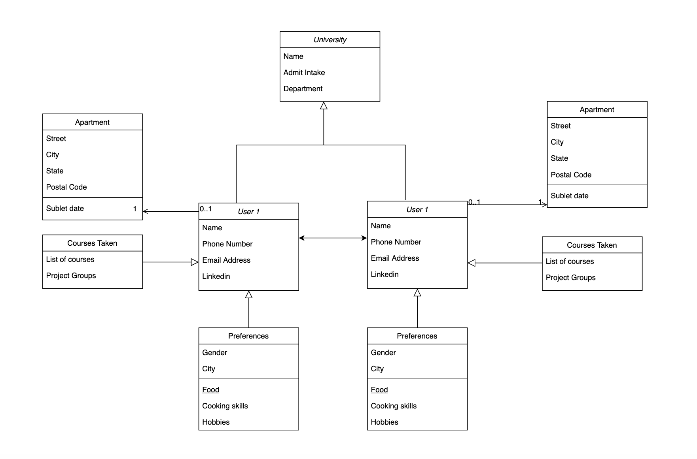

# INFO6150 13390 Web Design/User Experience Engineering

## Final Project Repository

## Project Title: UniBuddy - By Students For Students!

## Team Members:

- **Akshay Parab**
- **Kaushik Gnanasekar**
- **Shivam Thabe**
- **Swini Rodrigues**

## Introduction/Idea Description:

Attending a foriegn university can get challenging for new international students. The most common challenges include but are not limited to:

1. Things to pack
2. Arrival formalities
3. Looking for accomodation/housing
4. Meeting people with similar interests
5. Navigating through University and nearby spaces
6. Banking options
7. Etc.

We are developing **_UniBuddy_** which would serve as a one stop solution of necessary resources for prospective students. These resources will not only help students with onboarding but will also help in making them comfortable until they become completely independent.

## User Requirements

**User:**

- Signup
- Create Profile
- Add preferences like City, food preference, course, apartment type etc. for other users to find the perfect roommate
- Users can send connection request
- User will be able to check their current connections
- Create a new listing for subletting an apartment or for temporary accommodations.
- Create a new listing for finding roommates, this will include the user selected preferences.
- View listing of people trying to find roommates
- View listing of people trying to sublet

**Functional:**

- Listing based on timestamp
- Listing based on filters
- Segregated listing for people and apartments
- Chat feature for connections

## Domain Model

